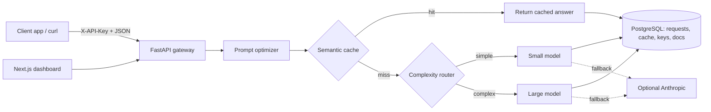

<div align="center">


**[Live dashboard](https://optillm.vercel.app)** · **[API health](https://optillm-api.onrender.com/health)**

</div>

## ✨ Overview

Calling a frontier LLM for every request is expensive, and many requests are near-duplicates or simple enough for a smaller model. **OptiLLM** is a gateway that sits between an application and its LLM provider. It **optimizes the prompt**, **routes** it to a cheaper or stronger model based on estimated complexity, **reuses cached answers** for semantically similar prompts, and records every request so cost and behavior are visible in a dashboard.

> 🚧 **Work in progress.** The gateway, dashboard and API-key flow run end to end. Benchmarking against a direct-to-provider baseline is still to be done — no performance claims are made until that is measured.

## 🧭 Architecture



## 🔑 Key features

| | Feature | Notes |
|---|---|---|
| ✅ | Semantic cache | Similar prompts reuse a stored answer (default similarity threshold `0.92`) |
| ✅ | Model router | Simple prompts → `gpt-4o-mini`, harder ones → `gpt-4o` (complexity threshold `0.50`) |
| ✅ | Prompt optimizer | Strips greetings/filler before embed → route → call |
| ✅ | Cost analytics | Actual spend vs an "everything on the large model" baseline |
| ✅ | API keys | `/v1/chat` requires `X-API-Key` |
| ✅ | Dashboard | Requests log, cache explorer, routing rules, documents, analytics |
| 🔜 | Benchmarks vs direct calls | Not measured yet |
| 🔜 | Auth on dashboard list endpoints | Currently intentionally open for the demo |

## 🧰 Tech stack


## 📈 Benchmarks

Benchmarks against direct provider calls (cache-hit latency, cost per 1k requests, cache hit rate, routing accuracy) are planned. No performance figures are claimed until they are measured.

## 🚀 Installation & usage

```bash
# 1. Postgres
docker compose up -d

# 2. Backend
cd backend
python3 -m venv .venv && source .venv/bin/activate
pip install -r requirements.txt
cp ../.env.example ../.env          # add a real OPENAI_API_KEY
uvicorn main:app --reload --port 8000

# 3. Frontend (new terminal)
cd app
npm install
echo 'NEXT_PUBLIC_API_URL=http://localhost:8000' > .env.local
npm run dev                          # http://localhost:3000
```

```bash
# create an API key, then call the gateway
curl -s -X POST http://localhost:8000/v1/keys -H 'Content-Type: application/json' -d '{"name":"my-app"}'

curl -s -X POST http://localhost:8000/v1/chat \
  -H 'Content-Type: application/json' -H 'X-API-Key: ollm_...' \
  -d '{"messages":[{"role":"user","content":"Summarize TCP in one sentence."}]}'
```

## 🗂️ Project structure

```
OptiLLM/
├── app/                 # Next.js 16 dashboard (analytics, cache, requests, playground…)
├── backend/             # FastAPI gateway (optimizer, router, cache, keys, documents)
├── docker-compose.yml   # Postgres 16
├── .env.example
├── DESIGN.md
└── README.md
```

## 🗺️ Roadmap

- [x] FastAPI gateway with API-key protected `/v1/chat`
- [x] Semantic cache + model routing + prompt optimizer
- [x] Dashboard (analytics, requests, cache, routing, documents, playground)
- [x] Deployed demo (Vercel + Render)
- [ ] Benchmark against direct provider calls and publish real numbers
- [ ] Protect dashboard/list endpoints with auth
- [ ] Add a LICENSE and tests

## 🙏 Acknowledgements

OpenAI API, FastAPI, Next.js, Recharts.

<div align="center">

### 👩‍💻 Author

**Yuvika Malhotra** — [GitHub](https://github.com/Yuvika687) · [LinkedIn](https://linkedin.com/in/yuvika-malhotra) · [Email](mailto:yuvikamalhotra1414@gmail.com)


</div>
